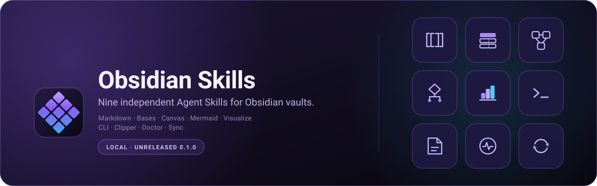
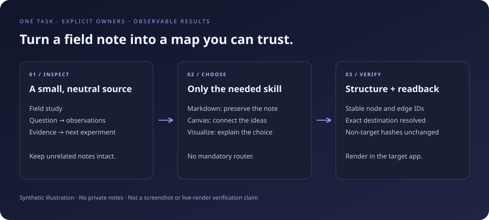

<p align="center">
  
</p>

<p align="center">
  <a href="README.md">English</a> · <b>한국어</b>
</p>

# Obsidian Skills

Obsidian 볼트 작업을 위한 독립된 Agent Skill 아홉 개: Markdown, Bases, Canvas, Mermaid, 시각 형식 선택, 공식 CLI, Web Clipper, 볼트 진단, 헤드리스 Sync.

모든 패키지는 자체 참조 문서와 스크립트를 가진 독립 `SKILL.md`입니다. 루트 스킬도, 디스패처도, 공용 런타임도, 호환 별칭도 없습니다. 에이전트는 그 작업에 필요한 패키지 하나만 불러오고 나머지는 건드리지 않습니다.

> **상태 — 0.1.0, 로컬 · 미배포.**
> 이 후보는 마켓플레이스나 레지스트리에 배포하지 않았고 릴리스 아카이브도 만들지 않았습니다. 각 경로는 문서 또는 로컬 CLI 증거를 표시하지만, 경로 확인은 설치 검증이 아닙니다 — 네이티브 설치·로드·노출은 미검증입니다. 로컬 소스를 문서화한 런타임(Claude Code, Codex, Grok)은 네이티브 경로를 본인 체크아웃으로 지정할 수 있고, 그 외에는 Agent Skills 디렉터리 가져오기(`./install.sh copy`)를 사용합니다.

---

## 왜 필요한가

- **형식마다 소유자는 하나.** 위키링크 질문은 `obsidian-markdown`으로, `.canvas` 그래프는 `obsidian-canvas`로 갑니다. 어떤 패키지도 다른 패키지를 대신해 몰래 답하지 않으므로 답의 출처를 감사할 수 있습니다.
- **능력은 권한이 아니다.** 형식을 안다고 쓰기 권한이 생기지 않습니다. 각 패키지는 정확한 대상 경로, 승인된 효과, 그리고 실제로 변경된 경로에서의 재확인(readback)을 요구합니다.
- **증거 등급을 섞지 않는다.** 파싱은 렌더링이 아니고, 디스크의 파일은 앱이 색인했다는 증거가 아니며, 종료 코드는 쓰기가 되었다는 증거가 아닙니다. 각 패키지는 자신이 도달한 등급을 밝힙니다.
- **무관한 내용은 그대로 남는다.** 부분 편집은 대상이 아닌 노트·프론트매터·ID·첨부를 보존하고, 그 사실을 장담이 아니라 해시로 보고합니다.

<p align="center">
  
</p>

<p align="center"><sub>이 저장소를 위해 직접 그린 합성 일러스트입니다 — 스크린샷이 아니며, 실제 렌더링을 주장하지 않습니다.</sub></p>

## 아홉 개 패키지

| 패키지 | 소유 범위 | 첫 사용 예 |
| --- | --- | --- |
| `obsidian-markdown` | Obsidian Flavored Markdown: 위키링크, 임베드, 콜아웃, 프로퍼티, 태그, 블록 참조, 수식, 각주. 비대상 보존과 재확인을 갖춘 정확한 부분 편집. | *"`Notes/Inbox.md`의 프로퍼티와 콜아웃만 고치고 나머지는 건드리지 마."* |
| `obsidian-bases` | `.base` 데이터베이스 뷰: YAML 스키마, 필터, 수식, 요약, table·cards·list·kanban·map 뷰, 그룹·정렬·제한, 그리고 완결된 로컬 함수 레퍼런스. | *"프로젝트 노트를 status로 묶은 Base 뷰를 만들어줘."* |
| `obsidian-canvas` | JSON Canvas 1.0 `.canvas` 문서: 노드·엣지 스키마, 좌표, 색상, 안정적인 ID, 검증. | *"이 노트 다섯 개를 라벨 붙은 엣지가 있는 캔버스 맵으로 만들어줘."* |
| `obsidian-mermaid` | 설치된 앱이 실제로 탑재한 Mermaid 빌드에서 렌더되는 블록: 다이어그램 계열 선택, 버전 게이트 문법, 대체안, 렌더 QA. | *"이 mermaid 블록이 읽기 모드에서 파스 오류가 나 — 고쳐줘."* |
| `obsidian-visualize` | 노트에 맞는 시각 형식(표, 캔버스, Mermaid, Excalidraw) 선택과, 표준 라이브러리만 쓰는 결정론적 `.excalidraw.md` 장면 생성. | *"이 비교에는 어떤 시각화가 맞는지 고르고 그려줘."* |
| `obsidian-cli` | 공식 `obsidian` 바이너리: 읽기, 생성, 검색, 이동, 덧붙이기, 프로퍼티·작업·태그·링크 감사, 플러그인/테마 개발 루프. | *"터미널에서 노트를 만들고 그 경로에서 그대로 다시 읽어줘."* |
| `obsidian-clipper` | Obsidian Web Clipper 캡처: 템플릿, 선택자, 변수, 페이지→노트 매핑. | *"출처와 저자를 남기는 아티클용 Clipper 템플릿을 만들어줘."* |
| `obsidian-doctor` | 민감정보를 제거한 증거로 플러그인·Templater 실패를 진단하는 읽기 전용 분류 스크립트. | *"새 노트에서 Templater가 안 돌아 — 증거를 분류해줘."* |
| `obsidian-sync` | Obsidian Sync용 헤드리스 `ob` 클라이언트(npm `obsidian-headless`): 페어링, 방향 선택, 단발/연속 실행, 사고 수습. | *"서버에 pull-only 헤드리스 동기화를 되돌릴 수 있게 세팅해줘."* |

체크아웃에 어떤 패키지가 들어 있는지는 `./install.sh skills`로 확인합니다.

## 설치

### 1. 로컬 체크아웃에서 시작

이 릴리스는 로컬·미배포이므로 온보딩은 이미 가지고 있는 체크아웃에서 시작합니다. 아래 명령은 네트워크에 접속하지 않습니다.

```sh
cd obsidian-skills
./install.sh skills      # 아홉 패키지 중 이 체크아웃에 있는 것
./install.sh routes      # 런타임별 공식 경로, 매니페스트, 스킬 디렉터리
```

### 2. 런타임 스킬 디렉터리로 복사 (지금 동작하는 경로)

```sh
# 기본은 드라이런: 충돌 보고서만 출력하고 아무것도 쓰지 않습니다.
./install.sh copy --runtime cursor --skill all --scope user

# 같은 계획을 실제로 복사.
./install.sh copy --runtime cursor --skill all --scope user --apply

# 사용자 프로필 대신 소비자 프로젝트에 한 패키지만.
./install.sh copy --runtime claude --skill obsidian-markdown \
  --scope project --project-root ~/work/notes --apply
```

`--scope user`는 해당 런타임의 사용자 스킬 디렉터리를, `--scope project`는 `<프로젝트 루트>/<런타임 스킬 디렉터리>`를 대상으로 하며 이 체크아웃 자신을 대상으로 지정하면 거부합니다. 디렉터리 복사는 일반 Agent Skills 가져오기이며, 설치 스크립트는 이를 네이티브 플러그인 설치라고 표기하지 않습니다.

### 3. 런타임별 네이티브 경로

`./install.sh native --runtime <id>`는 해당 런타임의 네이티브 명령을 그 경로를 확인한 근거와 함께 출력할 뿐 실행하지 않습니다. 아래의 `<source>`는 배포 후에는 `Xia-Ataraxia/obsidian-skills`, 0.1.0이 미배포인 동안에는 이 체크아웃 경로입니다.

| 런타임 | 경로 종류 | 이 저장소의 매니페스트 | 스킬 디렉터리 — 사용자 / 프로젝트 | 네이티브 경로 (출력만, 절대 실행하지 않음) |
| --- | --- | --- | --- | --- |
| `claude` — Claude Code | plugin-marketplace | `.claude-plugin/marketplace.json` + `.claude-plugin/plugin.json` | `~/.claude/skills` / `.claude/skills` | `claude plugin marketplace add <source>` → `claude plugin install obsidian-skills@obsidian-skills` (`--scope user\|project\|local`, 기본값 user) |
| `codex` — Codex / ChatGPT 데스크톱 앱 | plugin-marketplace | `.agents/plugins/marketplace.json` + `.codex-plugin/plugin.json` | `~/.agents/skills` / `.agents/skills` | `codex plugin marketplace add <source>` → `codex plugin add obsidian-skills@obsidian-skills`; 설치 지점은 ChatGPT 데스크톱 앱의 Plugins Directory이며 등록 후 앱을 재시작합니다 |
| `gjc` — GJC (Gajae Code) | plugin-marketplace | `.claude-plugin/marketplace.json` | `~/.gjc/agent/skills` / `.gjc/skills` | `gjc plugin marketplace add Xia-Ataraxia/obsidian-skills` → `gjc plugin install obsidian-skills@obsidian-skills --scope user`; 도움말이 `<source>`만 문서화하므로 로컬 경로 형식은 주장하지 않습니다 |
| `grok` — Grok Build | plugin-marketplace (문서화된 Claude Code 호환) | `.claude-plugin/marketplace.json` — Grok 전용 매니페스트는 없음 | `~/.grok/skills` / `.grok/skills` | `grok plugin marketplace add <source>` 후 TUI Marketplace 탭에서 설치; 직접 설치는 `grok plugin install Xia-Ataraxia/obsidian-skills` (git URL·GitHub 단축형·로컬 경로이며 `plugin@marketplace`는 받지 않음) |
| `hermes` — Hermes Agent | registry-tap (스킬 단위) | 없음 | `~/.hermes/skills` / `.hermes/skills` | `hermes skills tap add Xia-Ataraxia/obsidian-skills` → `hermes skills install Xia-Ataraxia/obsidian-skills/<name>` → `hermes skills update`; 탭 없이 설치하면 식별자에 경로가 들어갑니다: `…/obsidian-skills/skills/<name>`; 프로젝트 스킬은 `hermes skills trust` 이후에만 로드됩니다 |
| `cursor` — Cursor | skill-directory | 없음 | `~/.cursor/skills` / `.cursor/skills` | **자가 등록형 네이티브 경로 없음:** Marketplace는 심사·제출 방식이고 팀 마켓플레이스는 Teams/Enterprise 기능이며, Agent Plugin은 이 패키지가 제공하지 않는 루트 `plugin.json`을 요구합니다. 디렉터리 가져오기를 사용하세요. |
| `agent-skills` — 벤더 중립 | skill-directory | 없음 | `~/.agents/skills` / `.agents/skills` | **네이티브 경로 없음:** 이 명세는 패키지 형식만 정의합니다. Codex·Cursor·Grok이 모두 `~/.agents/skills`를 읽으므로 이 범위가 이식성 있는 사용자 수준 가져오기입니다. |

모든 행에 공통으로 적용되는 두 가지 한계:

- **경로 확인은 설치 검증이 아닙니다.** 각 행은 문서 또는 로컬 CLI 증거를 따로 표시합니다. GJC는 공개 문서가 아닌 설치된 CLI 증거를 사용합니다. 네이티브 설치 경로를 실행하거나 런타임에서 이 패키지가 로드되는 것을 확인하지 않았습니다.
- **배포된 것은 없습니다.** `Xia-Ataraxia/obsidian-skills` 형식은 배포된 저장소를 전제합니다. 그전까지는 로컬 소스를 문서화한 런타임(Claude Code, Codex, Grok)에서 체크아웃 경로를 쓰거나, 모든 런타임에서 동작하는 디렉터리 가져오기를 사용하십시오.

설치 후 첫 사용: 하려는 일을 평범한 문장으로 요청하고, 에이전트가 패키지를 고르지 못하면 이름을 지정하세요. 예: *"`obsidian-canvas`로 이 노트들을 맵으로 배치해줘."* GJC는 설치된 패키지를 `obsidian-skills:<name>`로 노출합니다. 다른 런타임이 어떤 형태로 노출하는지는 여기서 주장하지 않습니다.

### 요구 사항

| 대상 | 필요한 것 | 여기서 확인한 버전 |
| --- | --- | --- |
| 렌더링·색인이 필요한 모든 작업 | Obsidian 데스크톱 앱 | 1.12.7 (격리된 중립 프로필) |
| `obsidian-cli` | `PATH`에 등록된 공식 `obsidian` CLI | 1.12.7 (installer 1.12.7) |
| `obsidian-doctor`, `obsidian-visualize` 스크립트 | Python 3.9 이상, 표준 라이브러리만 | Python 3.14.7에서 실행; 3.9 런타임 호환성은 미검증 |
| `obsidian-clipper` | Obsidian Web Clipper 브라우저 확장 | 설치·실행하지 않음 |
| `obsidian-sync` | npm `obsidian-headless`(`ob`)와 Obsidian Sync 계정 | 기존 0.0.14: 도움말 및 미연결 로컬 디렉터리 거부만 확인 |
| 후보 테스트 스위트 실행 | `pip install -r requirements-dev.txt` (PyYAML) | Python 3.14.7 / PyYAML 6.0.3; 로컬 스위트 통과 |

설치 프런트엔드는 POSIX `sh`이며 `copy`는 Python 3.8 이상과 디렉터리 핸들 기반 파일 연산이 필요합니다. 원자적 게시는 macOS/Linux를 지원하며 다른 플랫폼에서는 거부합니다. macOS arm64와 Python 3.14.7에서 시험했고 Linux 및 Python 3.8 런타임 동작은 미검증입니다.

## 안전성

**설치 스크립트**

- 기본은 드라이런이며, 복사하려면 `--apply`가 필요합니다.
- 네트워크에 접속하지 않고, 런타임 자체의 설치·마켓플레이스·클론 명령을 실행하지 않습니다.
- 프로필 설정을 변경하지 않습니다: `settings.json`, `config.toml`, 탭 목록, 레지스트리, 잠금 파일 어느 것도 건드리지 않습니다. 쓰기는 핸들로 고정한 경로 디렉터리, 임시 준비 영역, 선택한 패키지 대상을 포함합니다. 검증 후 원자적으로 게시하며 기존 대상을 대체하지 않습니다. 생성된 캐시는 제외합니다.
- 선택된 모든 패키지를 먼저 점검합니다. 대상 위치에 파일·디렉터리·심링크·끊긴 심링크가 이미 있으면 작업 전체를 거부하고 아무것도 쓰지 않습니다 — 부분 복사는 없습니다.
- 이후 게시에 실패하면 보고된 준비 영역이 복구용으로 남을 수 있으며 `SKILL.md`는 `SKILL.unpublished`로 격리합니다. 격리·정리가 불완전하면 경고합니다. 앞서 게시된 패키지는 유지합니다. 보호 범위는 일반적인 동시 사용이며 같은 계정의 악의적인 준비 영역 변조까지 보장하지 않습니다.
- 스킬 이름은 소문자 경로 세그먼트 하나여야 하며, 대상은 확인된 실제 루트 안에 있고 이 소스 체크아웃 밖에 있어야 합니다.
- 알 수 없는 런타임은 추측하지 않고 거부합니다(`REFUSED`, 종료 코드 1). 사용법 오류는 종료 코드 2입니다.

**스킬**

- 형식 스킬은 쓰기 권한이 아닙니다. 정확한 볼트, 상대 경로 대상, 적용되는 현행 볼트 정책, 승인된 효과를 먼저 확정합니다. 정책 파일 자체는 필수가 아니지만, 권한이 없거나 충돌이 해결되지 않으면 읽기 전용으로 진행합니다.
- 앱·플러그인·CLI·네트워크 증거의 부재를 성공으로 바꾸지 않으며, 무관한 다른 도구로 대체할 근거로 삼지도 않습니다.
- 변경은 정확한 대상 경로에서 다시 읽어 확인하고, 무관한 노트·프론트매터·ID·첨부는 보존한 뒤 해시로 보고합니다.
- 예시는 합성 데이터이며 텔레메트리를 포함하지 않습니다. 로컬 보조 스크립트는 볼트 내용을 업로드하지 않습니다. 명시적으로 승인한 Sync 등 네트워크 작업은 별도의 데이터 전송 경계를 가지며, 그런 작업까지 오프라인이라고 보장하지 않습니다.
- 복구는 승인된 소스와 설정만 되돌립니다. 사용자 노트를 초기화·미러·삭제·덮어쓰기하는 지름길은 쓰지 않습니다.

자세한 내용: [docs/security-and-privacy.md](docs/security-and-privacy.md).

## 실제로 검증된 것

전체 표: [docs/verification-matrix.md](docs/verification-matrix.md). 경로별 상세: [docs/install-matrix.md](docs/install-matrix.md).

**통과 — 로컬·격리·중립 픽스처** (보고서: [tests/evidence/native-app.json](tests/evidence/native-app.json))

- 격리된 합성 볼트에 대한 공식 CLI 1.12.7: `create` → `search` → `move` → 새 경로에서 재확인까지 수행되고 이전 경로는 사라졌으며, 없는 원본에서의 이동은 아무것도 만들지 않았습니다. 대상 충돌 시험에서는 원본·대상·무관한 노트의 해시가 보존됐습니다.
- 격리된 프로필의 Obsidian 1.12.7 데스크톱 앱: 무관한 프로퍼티와 본문이 바이트 단위로 보존된 Markdown 부분 편집, `Field.md`에서 해석된 `Field.canvas`, 필터·그룹·정렬·제한이 적용된 Bases 뷰(2행, 보관 노트 제외, 원본 노트 불변)와 손상된 `.base`를 파싱 불가로 보고하는 동작, 기존 노드가 보존된 채 세 노드·라벨 엣지 두 개로 확장된 캔버스, SVG로 렌더된 `mermaid` 플로차트, 그리고 알 수 없는 다이어그램 종류를 조용히 넘기지 않고 오류로 보고하는 동작.
- 두 README 모두 로컬 렌더링 확인(markdown-it 및 Chromium): 이미지가 대체 텍스트와 함께 로드되고 1200px에서 가로 오버플로가 없습니다.

**통과 안의 한계 — 초록색 결과를 믿기 전에 읽으십시오**

- 이 CLI는 오류를 출력하면서도 종료 코드 0을 반환합니다(예: `Error: Destination file already exists!`). 쓰기의 증거는 종료 상태가 아니라 출력과 대상 경로 재확인입니다.
- 잘못된 Bases 식은 명확한 파싱 오류 대신 0행과 오류 성격의 필터 표시를 났습니다. 빈 행은 검증 성공이 아닙니다.
- 앱 버전 하나, 프로필 하나, 작은 합성 볼트 하나, 단발 실행입니다. 공개 저장소 호스트에서의 렌더링은 수행하지 않았습니다.

**수행하지 않음 — 지원으로 읽지 마십시오**

- 어떤 런타임에서도 네이티브 플러그인·마켓플레이스 설치를 하지 않았고, 어디에도 배포하지 않았으며, 런타임이 이 패키지를 발견·노출한다는 증거도 없습니다.
- Web Clipper 확장을 설치하지 않았고 페이지를 캡처하지 않았습니다.
- Excalidraw 플러그인을 설치하지 않았습니다. 장면 생성기는 정적 검증까지이며 렌더링에 대해서는 아무것도 증명하지 않습니다.
- Obsidian Sync 페어링, 네트워크 전송, 데몬 실행, 복구를 하지 않았습니다.

**통과 — 로컬 자동 검사**

- 패키지 격리, 형식 계약, 보조 스크립트 동작, 폐기 가능한 설치·복구 사례, 프라이버시, 소스 소유권과 원본 자산 검사가 통과했습니다. 고정된 두 소스의 50개 파일·135개 책임 단위·9개 고유 기능 소유자를 감사했습니다. 재현 명령과 증거 한계는 검증 표에 있습니다.
- 합성 브라우저 선택자는 통과했고 선택자 변경을 감지했습니다. 공개 페이지 선택자는 실패해 캡처를 중단했으며 확장 프로그램이나 실시간 캡처 성공으로 간주하지 않습니다. Headless 0.0.14는 미연결 임시 디렉터리에 종료 코드 3을 반환했고 계정·네트워크 작업은 수행하지 않았습니다.

## 저장소 구성

```
skills/obsidian-*/       패키지마다 독립 (SKILL.md, references/, scripts/)
install.sh               라우트 테이블 + 충돌 검사 복사 설치 스크립트
assets/                  직접 제작한 브랜드·데모 아트와 asset-ledger.json
docs/                    설치 표, 검증 표, 보안, 전환 절차
tests/                   격리 후보 테스트 스위트 (requirements-dev.txt 참고)
scripts/audit_inventory.py   책임 단위 감사
AGENTS.md                기여자와 에이전트를 위한 저장소 계약
```

## 라이선스와 출처

MIT — 두 저작권 고지가 모두 담긴 [LICENSE](LICENSE)를 참고하십시오.

`obsidian-markdown`, `obsidian-bases`, `obsidian-canvas`, `obsidian-cli`의 일부는 [kepano/obsidian-skills](https://github.com/kepano/obsidian-skills)의 커밋 `3ccff5338ea700537839b21900aa5358a0402c98`(MIT, Copyright © 2026 Steph Ango)에서 가져와 수정한 것입니다. 나머지 다섯 패키지는 여기서 직접 작성한 원본입니다. 각 패키지의 `CHANGELOG.md`에 정확한 원본 리비전, 가져온 파일, 가한 수정이 모두 기록되어 있습니다.

`assets/`의 브랜드·데모 아트는 이 저장소를 위해 직접 제작한 벡터 원본이며, 파일별 제작자·출처·권리는 [assets/asset-ledger.json](assets/asset-ledger.json)에 기록되어 있습니다. 벤더 로고, 아이콘 세트, 애플리케이션 스크린샷은 포함하지 않았습니다. "Obsidian"은 이 스킬들이 대상으로 하는 서드파티 애플리케이션의 이름이며, 제휴나 보증 관계를 주장하지 않습니다.
