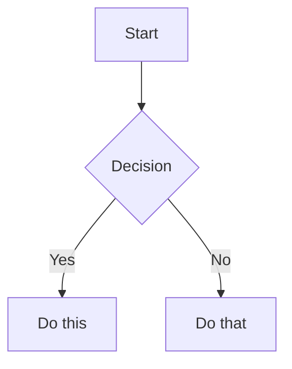

# Obsidian Flavored Markdown Skill

Create and edit valid Obsidian Flavored Markdown. Obsidian extends CommonMark and GFM with wikilinks, embeds, callouts, properties, comments, and other syntax. This skill covers only Obsidian-specific extensions -- standard Markdown (headings, bold, italic, lists, quotes, code blocks, tables) is assumed knowledge.

This package is the owner of that syntax. Every rule, example, and reference needed to write it is in this package; there is no other package to look up first.

## Scope

Owned here:

- Obsidian-specific Markdown syntax, its field and type rules, and its examples.
- The target, authorization, and preservation rules that apply while writing to a note.
- Destination readback for links and embeds after a change, and the separation between destination resolution and rendering.

Not owned here:

- What a note should say, where it belongs, which template frames it, what provenance it must carry, and the house style it follows. Respect applicable live vault policy and explicit task-bound choices. If no policy file exists, clarify only unresolved decisions rather than inventing conventions.
- `.canvas` graph structure, `.base` file internals, and vault-aware CLI operations. Name the matching skill by identity -- `obsidian-canvas`, `obsidian-bases`, `obsidian-cli` -- only when the task actually reaches that artifact and that skill is loaded in the current runtime. When it is not, report the gap rather than improvising a schema or a command.

This skill is standalone. It requires no vault plugin, mutation server, environment variable, or personal configuration. Applicable live vault policy always governs the task. Optional personal-policy tools, an Obsidian mutation server, or a vault-aware CLI compose only when selected; their absence is normal. A missing policy file does not erase explicit task-bound authorization or permit inventing house rules.

## Resolve the target before writing

Writing syntax correctly is not authority to change a vault. Before the first mutation, resolve all four of the following, and keep the work read-only until they are known:

| What | Resolved when you can state it exactly |
|------|----------------------------------------|
| Vault root | The directory the user named for this task, as an exact path |
| Target note | Its vault-relative path, including extension, not just a title |
| Effect | Create, insert, replace, or delete -- named at the level of a section, property, or link |
| Authority | The user's request, or a standing instruction for this vault, covers that note and that effect |

Reuse authority the current task already granted; do not ask again for a note and effect that are already covered. When the vault, the note, the effect, or the authority is missing or ambiguous, stop at a read-only answer and name the specific missing item.

When the user selected a vault-aware surface (an app command surface or a CLI), write through it rather than around it. Otherwise use the ordinary file write and edit tools of the host. Never assemble note content with shell text redirection or stream editors; they silently reformat, drop trailing newlines, and mangle YAML and callout prefixes.

## Authorized change and preservation

1. **Read before writing.** Load the current note, including its frontmatter, before editing it.
2. **Change only what was requested.** One property, one section, one link -- not the surrounding note.
3. **Preserve everything else exactly:** unrelated properties and their order, headings, block identifiers (`^block-id`), existing links and embeds, aliases, tags, `%%comments%%`, footnote definitions, code fences, indentation, and the file's existing line-ending and trailing-newline style.
4. **Do not normalize.** No whole-note reflow, no reordering frontmatter keys, no rewriting link style from wikilink to Markdown link or back, no re-casing headings, unless that normalization is the request.
5. **Do not rename or move a file to make a link resolve.** Renaming rewrites links across the vault and is a separate effect that needs its own approval; fix the link text instead.
6. **Treat as destructive** -- and require explicit scope -- deleting sections, clearing or replacing whole frontmatter, bulk find-and-replace across notes, and removing links or embeds in bulk.

## Workflow: creating or editing a note

1. **Resolve the target** as above; read the note first when it already exists.
2. **Add frontmatter** with properties (title, tags, aliases) at the top of the file. See [PROPERTIES.md](references/PROPERTIES.md) for all property types.
3. **Write content** using standard Markdown for structure, plus Obsidian-specific syntax below.
4. **Link related notes** using wikilinks (`[[Note]]`) for internal vault connections, or standard Markdown links for external URLs.
5. **Embed content** from other notes, images, or PDFs using the `![[embed]]` syntax. See [EMBEDS.md](references/EMBEDS.md) for all embed types.
6. **Add callouts** for highlighted information using `> [!type]` syntax. See [CALLOUTS.md](references/CALLOUTS.md) for all callout types.
7. **Read the note back** and check the changed destinations, then **verify** the note renders correctly in Obsidian's reading view.

> When choosing between wikilinks and Markdown links: use `[[wikilinks]]` for notes within the vault (Obsidian tracks renames automatically) and `[text](url)` for external URLs only.

## Internal Links (Wikilinks)

```markdown
[[Note Name]]                          Link to note
[[Note Name|Display Text]]             Custom display text
[[Note Name#Heading]]                  Link to heading
[[Note Name#^block-id]]                Link to block
[[#Heading in same note]]              Same-note heading link
```

Define a block ID by appending `^block-id` to any paragraph:

```markdown
This paragraph can be linked to. ^my-block-id
```

For lists and quotes, place the block ID on a separate line after the block:

```markdown
> A quote block

^quote-id
```

## Embeds

Prefix any wikilink with `!` to embed its content inline:

```markdown
![[Note Name]]                         Embed full note
![[Note Name#Heading]]                 Embed section
![[image.png]]                         Embed image
![[image.png|300]]                     Embed image with width
![[document.pdf#page=3]]               Embed PDF page
```

See [EMBEDS.md](references/EMBEDS.md) for audio, video, search embeds, and external images.

## Callouts

```markdown
> [!note]
> Basic callout.

> [!warning] Custom Title
> Callout with a custom title.

> [!faq]- Collapsed by default
> Foldable callout (- collapsed, + expanded).
```

Common types: `note`, `tip`, `warning`, `info`, `example`, `quote`, `bug`, `danger`, `success`, `failure`, `question`, `abstract`, `todo`.

See [CALLOUTS.md](references/CALLOUTS.md) for the full list with aliases, nesting, and custom CSS callouts.

## Properties (Frontmatter)

```yaml
---
title: My Note
date: 2024-01-15
tags:
  - project
  - active
aliases:
  - Alternative Name
cssclasses:
  - custom-class
---
```

Default properties: `tags` (searchable labels), `aliases` (alternative note names for link suggestions), `cssclasses` (CSS classes for styling).

See [PROPERTIES.md](references/PROPERTIES.md) for all property types, tag syntax rules, and advanced usage.

## Tags

```markdown
#tag                    Inline tag
#nested/tag             Nested tag with hierarchy
```

Tags can contain letters, numbers (not first character), underscores, hyphens, and forward slashes. Tags can also be defined in frontmatter under the `tags` property.

## Comments

```markdown
This is visible %%but this is hidden%% text.

%%
This entire block is hidden in reading view.
%%
```

## Obsidian-Specific Formatting

```markdown
==Highlighted text==                   Highlight syntax
```

## Math (LaTeX)

```markdown
Inline: $e^{i\pi} + 1 = 0$

Block:
$$
\frac{a}{b} = c
$$
```

## Diagrams (Mermaid)

````markdown

````

To link Mermaid nodes to Obsidian notes, add `class NodeName internal-link;`.

## Footnotes

```markdown
Text with a footnote[^1].

[^1]: Footnote content.

Inline footnote.^[This is inline.]
```

## Link targets that are not Markdown notes

Obsidian resolves a bare wikilink stem to a Markdown note. For every other file type, keep the extension in the link, as [Obsidian's internal-link documentation](https://help.obsidian.md/links) requires:

```markdown
[[Team Board.canvas]]                  Canvas file
[[Team Board.canvas|Board]]            Canvas file with display text
[[Reading List.base]]                  Base file
[[Architecture Diagram.png]]           Image file
[[Handbook.pdf]]                       PDF file
```

`[[Team Board]]` is a different link: it reaches a Markdown note of that name if one exists, and otherwise stays unresolved. It never proves that the Canvas was reached.

When several files share a basename, which one a bare link reaches depends on the source note's own location, so include enough of the vault-relative folder path to make the target unambiguous:

```markdown
[[Projects/Team Board.canvas]]
```

## Destination readback

A write that returned no error is not a verified change. After every mutation, do the readback that matches what changed.

**1. Text readback (always).** Re-read the note from the vault. Confirm the intended change is present, the frontmatter still parses, and nothing else moved.

**2. Destination readback (whenever a link or embed changed).** Resolve the link *in the context of the note that contains it* -- Obsidian resolves link text relative to the source note, so a destination is only correct with respect to that note. Through the app's supported scripting surface:

```js
app.metadataCache.getFirstLinkpathDest(linkpath, sourcePath)
```

- `linkpath` is the destination text only: no `[[` `]]` delimiters, no `|display text`, no `#heading` or `#^block-id` subpath. For `[[Projects/Team Board.canvas|Board]]` it is `Projects/Team Board.canvas`.
- `sourcePath` is the vault-relative path of the note that holds the link.
- `null` means the link is unresolved.
- A returned file whose `path` differs from the intended vault-relative target is a wrong destination, even though nothing reports it as unresolved.
- Do not use "the note has no unresolved links" as the check. Unrelated links and intentional placeholders say nothing about whether this destination is right.
- When the app or its index is unavailable, report destination resolution as unverified. A file of the same name existing on disk is not resolution evidence, because a bare stem may resolve elsewhere.

**3. Render check (whenever an embed changed).** Resolution does not prove rendering. Open reading view and look at the embed itself. Per [Obsidian's embed documentation](https://help.obsidian.md/embeds), an embedded canvas shows only the shapes, not the text inside cards -- that is expected behavior, not a broken link; open the canvas itself to inspect its content. When no app is available to render, report the render leg as unverified rather than inferring it from the note's source text.

## Complete Example

````markdown
---
title: Project Alpha
date: 2024-01-15
tags:
  - project
  - active
status: in-progress
---

# Project Alpha

This project aims to [[improve workflow]] using modern techniques.

> [!important] Key Deadline
> The first milestone is due on ==January 30th==.

## Tasks

- [x] Initial planning
- [ ] Development phase
  - [ ] Backend implementation
  - [ ] Frontend design

## Notes

The algorithm uses $O(n \log n)$ sorting. See [[Algorithm Notes#Sorting]] for details.

![[Architecture Diagram.png|600]]

Reviewed in [[Meeting Notes 2024-01-10#Decisions]].
````

## Anti-patterns

- Writing a note before the vault root, vault-relative target, and authorized effect are all known -- resolve them first and stay read-only until then.
- Rewriting a whole note to change one property or one link -- edit the smallest region and leave the rest byte-identical.
- Dropping the extension from a `.canvas`, `.base`, `.png`, or `.pdf` link -- a same-stem link is a different target.
- Calling a link verified because the file exists on disk -- resolve it from the source note, or report the check as unverified.
- Calling an embed verified because the link resolved -- resolution and rendering are separate checks.
- Reading "embedded canvas shows shapes only" as a defect and rewriting the link -- it is documented behavior.
- Composing note text with shell redirection or stream editors -- use the host's write and edit tools, or the vault-aware surface the user selected.
- Building a local `.canvas` or `.base` schema here because the matching skill is absent -- report the gap instead.
- Treating this syntax as plain CommonMark -- wikilinks, embeds, callouts, comments, and highlights have no CommonMark equivalent and are lost by generic Markdown tooling.

## Verification

- [ ] Vault root, vault-relative target, effect, and authority were resolved before writing.
- [ ] The note was read before the edit, and only the requested content changed.
- [ ] Unrelated properties, block IDs, comments, links, and formatting are byte-identical.
- [ ] Frontmatter still parses as YAML and keeps its original key order.
- [ ] Non-Markdown link targets keep their extension and disambiguating folder path.
- [ ] Every changed link was resolved from its source note and matched the intended path, or the check was reported as unverified.
- [ ] Every changed embed was checked in reading view, or the render leg was reported as unverified.
- [ ] Destructive effects had explicit approved scope, or were skipped.

## References

- [Obsidian Flavored Markdown](https://help.obsidian.md/obsidian-flavored-markdown)
- [Internal links](https://help.obsidian.md/links)
- [Embed files](https://help.obsidian.md/embeds)
- [Callouts](https://help.obsidian.md/callouts)
- [Properties](https://help.obsidian.md/properties)
- [CALLOUTS.md](references/CALLOUTS.md) -- callout types, aliases, folding, nesting, custom CSS
- [EMBEDS.md](references/EMBEDS.md) -- every embed form, sizing, and embed-specific readback
- [PROPERTIES.md](references/PROPERTIES.md) -- property types, YAML rules, tags, safe frontmatter edits
