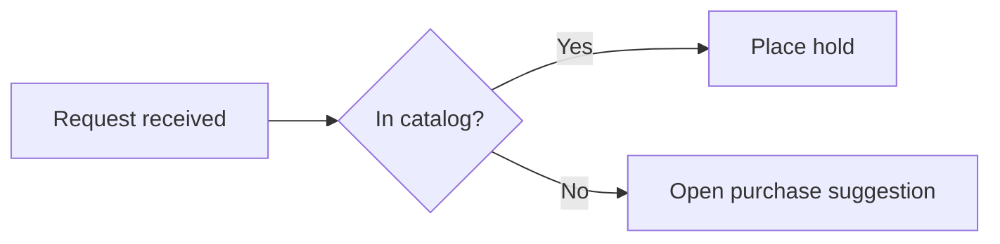

# Obsidian Mermaid

Produce a Mermaid block that carries the intended meaning and renders in the Mermaid build the target Obsidian installation actually ships.

Done means: the diagram family fits the relationship being shown, the prefix and grammar are accepted by the bundled renderer, the source sits in an exact `mermaid` fence, unrelated note content is byte-for-byte untouched, and every claim is backed by the evidence level that actually produced it.

## Evidence ladder

These are four separate claims. Never report a higher level on the strength of a lower one.

| Level | What it proves | How it is produced |
| --- | --- | --- |
| A — Authoring check | The prefix, grammar, labels, and fence follow the documented rules | Reading the source against [`references/diagram-catalog.md`](references/diagram-catalog.md) and the rules below |
| B — Parse validation | Some named Mermaid build accepts the grammar | An external parser (Mermaid CLI, live editor) whose version you state |
| C — Materialized readback | The intended bytes are in the intended note and nothing else moved | Re-reading the file after the write and diffing against what you intended |
| D — Render QA | This vault's bundled renderer draws it | Opening the note in the target Obsidian and looking at the result |

B is not D. A parse pass in mermaid.live proves the grammar against the newest upstream release, not against the pinned build inside the vault; a version-gated prefix can pass B and still fail D. C is not D either: writing a fence is not rendering it.

When a level cannot be reached — no app access, no vault authorization, headless environment — say which level was reached and name the rest as unverified. Do not promote an assumption into a result.

## Workflow

1. **State the meaning first.** Write the sentence the diagram must communicate (sequence of steps, message order, state transitions, proportions, hierarchy, flow quantities). The sentence chooses the family; a diagram that does not carry it is the wrong diagram regardless of how well it renders.
2. **Pick the smallest family that carries it** using the table below.
3. **Apply the compatibility gate** in [`references/compatibility.md`](references/compatibility.md) before committing to a version-gated family. Unknown bundle means treat it as old.
4. **Start from the catalog entry**, not from memory. Replace labels and data; leave the grammar alone.
5. **Write labels** under the escaping and readability rules below.
6. **Fence it exactly** (see Fences and placement).
7. **Only if the task actually edits a note:** confirm write authorization for that exact note, make the narrowest possible edit, and read the file back (see Editing a note safely).
8. **Render QA** in the target installation, recording the Obsidian app and installer versions it reports.
9. **On a renderer failure, fall back without losing meaning** (see Failing without degrading meaning).

## Choosing the family

| The meaning to carry | Family | Notes |
| --- | --- | --- |
| Ordered steps with branches | `flowchart TD` / `flowchart LR` | The default; also the fallback for any structural diagram |
| Who sends what to whom, in order | `sequenceDiagram` | Name participants explicitly; arrow type encodes sync/async/return |
| Types, fields, and cardinality | `classDiagram` | Use for a domain model, not for runtime steps |
| Lifecycle of one thing | `stateDiagram-v2` | Exact `-v2` suffix; the unsuffixed form is the legacy renderer |
| Stored entities and their keys | `erDiagram` | Schema shape, not process |
| Dated work with durations | `gantt` | Needs `dateFormat`; durations, not vibes |
| Step-by-step experience with scores | `journey` | Score and actor follow each task label |
| Parts of one whole | `pie` | Quote every label; one level only |
| Branching outline of one topic | `mindmap` | Indentation is the grammar — keep it consistent |
| Dated milestones in order | `timeline` | One period line, then its events |
| Quantified flow between stages | `sankey` | CSV-shaped rows: source, target, value |
| Work items across workflow columns | `kanban` | Version-gated |
| Nested proportions | `treemap-beta` | Version-gated |
| Services, groups, and their links | `architecture-beta` | Version-gated |
| Numeric series over categories | `xychart-beta` | Version-gated |

Split a diagram at a real boundary (phase, actor, subsystem) as soon as labels overlap or edges cross unreadably. Two readable diagrams beat one complete unreadable one. Do not enforce an arbitrary node count; readability in the target note width is the test.

## Syntax that actually breaks

- **Prefix is literal.** `stateDiagram-v2`, `sequenceDiagram`, `classDiagram`, `architecture-beta`, `treemap-beta`, `xychart-beta` — exact case, exact suffix. A wrong prefix is a parse error, not a fallback.
- **`flowchart` vs `graph`.** Both are accepted; `flowchart` is the current documented keyword and the one to write. Older notes using `graph` do not need rewriting to render.
- **Lowercase `end` breaks a flowchart.** Write `End` or `END`, or put the word inside a quoted label.
- **A node id starting with `o` or `x` right after an edge changes the edge.** `A---oB` is a circle edge and `A---xB` a cross edge; add a space or capitalize (`A--- Ops`).
- **Quote troublesome labels.** Parentheses, colons, slashes, `#`, and non-ASCII belong inside `"..."`: `id1["Renewal (second request)"]`. Quote the label, not the identifier, and do not add quotes to grammars that take bare keys, such as `architecture-beta` service ids.
- **Escape with entity codes when quoting is not enough.** `#quot;` for a double quote, `#35;` for `#`, decimal codes like `#9829;`, or HTML character names.
- **There is no `\n`.** A literal backslash-n renders as the two characters. Use `<br/>` for a line break, or a Markdown string label — a double-quoted label whose text is wrapped in backticks — which accepts real line breaks and `**bold**` inside the label.
- **Subgraph `direction` is advisory.** Mermaid ignores it once a node inside the subgraph has an edge crossing the boundary; do not rely on it for layout.
- **Comments are `%%` at line start.** They are not Markdown comments and not HTML comments.

## Fences and placement

The block must open with exactly three backticks followed by `mermaid`, with nothing else on the line, and close on its own line:

````markdown

````

- One diagram per fence. A second prefix inside the same fence is a parse error.
- To show a Mermaid block as example text rather than render it, wrap it in a four-backtick fence, as above.
- Inside a callout or blockquote, every line of the block — including both fence lines — needs the `>` prefix.
- Inside a list item, indent the whole block to the item's content column.
- Obsidian links from diagram nodes use the `internal-link` class (`class NodeA,NodeB internal-link;`); quote note names containing special characters. Those links do not appear in Graph view.

## Editing a note safely

Authoring a diagram grants no write permission. A write needs the task's own authorization for that exact note, and the vault's live policy still decides placement and house style.

- Read the note first; locate the exact insertion point or the exact existing fence to replace.
- Anchor the edit on unique surrounding text, replacing only the diagram block. Never reformat, re-wrap, reorder, or "clean up" anything else, including frontmatter, tags, and whitespace.
- Never write vault notes with shell redirection or stream editors. Use the host file-editing tool or the vault-aware surface the task selected.
- Read the file back after the write and confirm both that the fence is exactly as intended and that unrelated content is unchanged. A successful write call is not readback.
- Compose the `obsidian-markdown` package by identity only when the task genuinely also changes note prose, links, embeds, or properties. Pure diagram authoring does not need it.

## Failing without degrading meaning

When the target bundle rejects the chosen family, the replacement must still carry the sentence from step 1.

1. Re-state what the original diagram encoded: entities, relations, order, quantities, hierarchy.
2. Choose a fallback that keeps all of it — usually `flowchart` for structure, `pie` for a single-level proportion, or a Markdown table for values.
3. If the fallback cannot carry part of it (a `pie` drops hierarchy; a `flowchart` drops magnitudes), ship the fallback **and** the dropped information in a table or list beside it.
4. Say so in the note or the report: which family was intended, what the target rejected, what the fallback preserves, and what it does not.

Silently shipping a smaller diagram that says less is a wrong answer that looks like a right one. So is leaving a broken fence in place because the fallback would be uglier.

Never click through a security, trust, or permission dialog in the target app to make a diagram render. Stop and hand that decision to the operator.

## Requirements

- A target Obsidian installation for level D. Its Mermaid build is pinned into the app, is not separately installable, and is not user-selectable; record the app and installer versions the app reports rather than guessing a Mermaid version.
- Official sources for grammar and behavior: [Mermaid documentation](https://mermaid.js.org/intro/) for syntax and version gates, [Obsidian's advanced formatting help](https://help.obsidian.md/advanced-syntax) for the fence and `internal-link` behavior. Prefer these over blog posts, generators, and other tools' Mermaid support.
- No plugin, CLI, or network access is required to author a diagram. An external parser is optional and only ever produces level B.
- When an Obsidian release changes the bundled renderer, re-run the capability probe in [`references/compatibility.md`](references/compatibility.md), correct the affected catalog entries, and append this package's CHANGELOG.

## Boundaries

This package owns Mermaid source that lives inside Obsidian notes: family choice, grammar, labels, fences, bundle compatibility, and render evidence.

- Freeform drawings, spatial canvases, and generated scenes belong to `obsidian-canvas` and `obsidian-visualize`, not to a Mermaid fence.
- Note prose, wikilinks, embeds, properties, and house style belong to `obsidian-markdown`.
- Mermaid rendered anywhere other than the target Obsidian install — a static site, a code host, a live editor — does not inherit this compatibility baseline and is out of scope.
- Vault policy owns whether the note may be written at all.

## Verification

- [ ] The sentence the diagram must carry is stated, and the family carries it.
- [ ] The prefix is exact, and any version-gated family passed the compatibility gate.
- [ ] Labels are quoted or escaped where the grammar needs it, and contain no literal `\n`.
- [ ] The block is in an exact `mermaid` fence, one diagram per fence, correctly nested if inside a callout or list.
- [ ] If a note was edited: authorization existed, the edit was anchored, and readback confirmed unrelated content is unchanged.
- [ ] The highest evidence level actually reached is reported as such, with the Obsidian app and installer versions when level D was reached.
- [ ] Any fallback preserves the original meaning, or explicitly lists what it drops.
