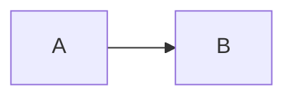
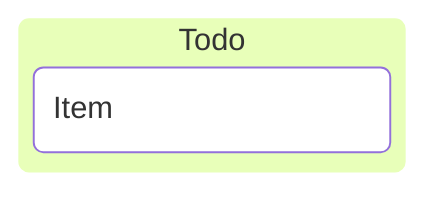
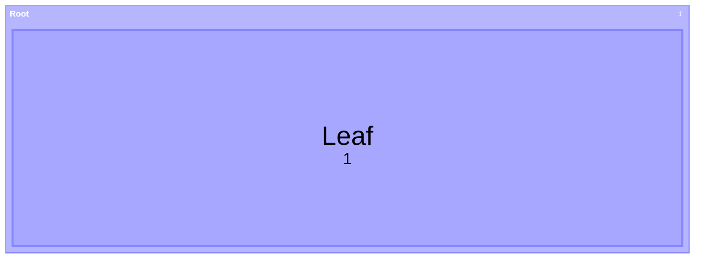
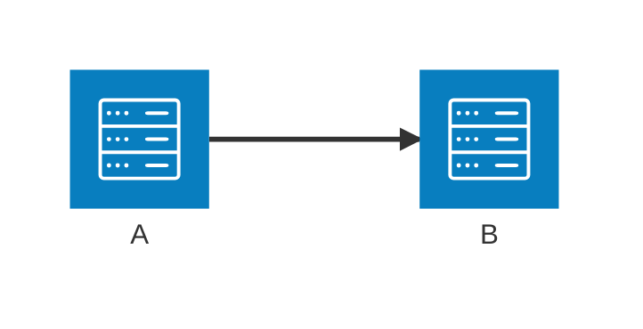
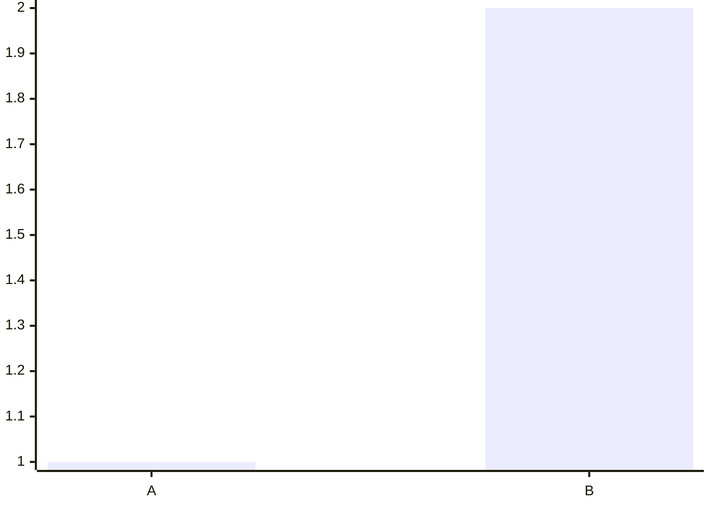
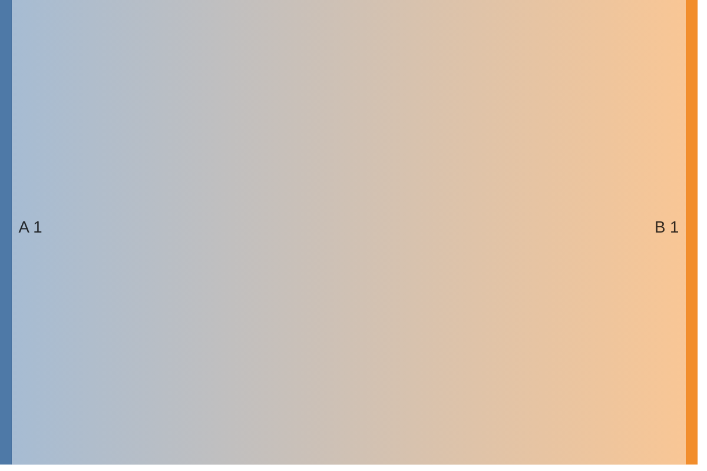

# Compatibility gate

Decide whether a diagram family will render in the Obsidian installation that actually holds the note, before writing it there.

## Why this is a separate question

Obsidian ships a Mermaid build pinned inside the app. It is not a plugin, not separately installable, and not user-selectable: it moves only when the app moves, and each installation is therefore frozen at whatever the installed app carries. Every other place that renders Mermaid — the upstream live editor, the documentation site, code hosts, other note apps — tracks a different version on a different schedule.

Two consequences:

- **A pass elsewhere is not evidence here.** The live editor follows the newest upstream release, so a version-gated family passes there while the vault's older bundle rejects it.
- **Even a rendering diagram can look different.** Upstream changed flowchart defaults at v12.0.0 — theme, look, and layout engine — so identical source drawn by an 11.x bundle and a 12.x one produces visibly different pictures. Judge appearance only in the target.

## The gate

1. Is the family in the catalog's conservative core? Use it.
2. Version-gated, and you have observed evidence from *this* installation? Use it, and record the evidence.
3. Version-gated with no observed evidence? Either run the probe below, or ship the documented fallback and disclose that the preferred family was untested. An unknown bundle is an old bundle.

Never resolve step 3 by assuming, by quoting a version number from another machine, or by citing a render that happened somewhere else.

## Keyword notes

| Family | Write this | Why |
| --- | --- | --- |
| `flowchart` | `flowchart` | `graph` is an accepted alias; `flowchart` is the current documented keyword |
| `stateDiagram-v2` | `stateDiagram-v2` | The unsuffixed form selects the legacy renderer |
| `architecture-beta` | `architecture-beta` | Upstream documents this diagram as v11.1.0+ |
| `treemap-beta` | `treemap-beta` | Documented keyword; upstream flags the syntax as still evolving |
| `sankey` | `sankey-beta` | Current upstream detects `sankey` with an optional `-beta`; older bundles accept only the suffixed form, so the suffix is the compatible spelling |
| `xychart` | `xychart-beta` | Same optional-suffix pattern: current docs show the bare keyword, older bundles need `-beta` |
| `kanban` | `kanban` | No documented version badge; treat as version-gated and probe |

The optional-suffix pattern is the useful general rule: when upstream accepts both spellings, the `-beta` one is the spelling that also works on older bundles.

A `---` delimited config header inside the fence (`config:` with `theme`, `look`, per-diagram options) is itself version-gated, independently of the diagram family. If a block fails, remove the config header and retest before concluding the family is unsupported.

## Capability probe

Running the probe writes a note. That is a vault mutation: it needs the task's own authorization, an agreed location, and an agreed cleanup. A scratch vault avoids the question entirely and answers it just as well, because the bundle belongs to the app, not to the vault.

Put one fence per candidate family into a single note, each with the smallest body that family accepts:

````markdown











````

Open the note in the target installation and read the result per block. A drawn diagram is a pass. An error message, a raw dump of the source, or a blank area where the block should be is a failure — all three mean the same thing for the gate.

Check both Reading view and Live Preview: the same block can render in one and not the other, and both are reachable by whoever reads the note.

## Reading a failure

| Symptom | Most likely cause | Next step |
| --- | --- | --- |
| The minimal probe block for a family fails | The bundle has no such diagram | Use the fallback; stop trying to rewrite the grammar |
| The minimal block renders but yours does not | A newer feature inside a supported family | Remove the newest-looking parts (config header, metadata, styling, per-point labels) one at a time until it renders |
| It renders but is unreadable or overflows | Readability, not compatibility | Split the diagram or shorten labels; do not change family |
| It renders on desktop but not after sync to another device | A different app version on that device | Probe there too; record both |

Bisecting is the point of step two: a diagram that fails as a whole and renders after one line is removed has told you exactly which feature the bundle lacks.

## Render QA, and what it is not

Parse validation and render QA answer different questions. Parsing says a grammar was accepted by some build. Render QA says this installation drew this diagram in this note.

Render QA is done when all of these have been looked at:

- The block draws a diagram in Reading view and in Live Preview.
- Labels are legible at the note's actual width, not just in a wide editor pane.
- The diagram is readable in the theme the vault actually uses, including dark mode if that is the default.
- No label is clipped, overlapped, or pushed outside the diagram box.
- If the note is exported or read on another device, the diagram was checked there too.

If any of these could not be checked, say which, rather than implying a full pass.

## Recording the result

Record what was observed, not what was assumed:

```text
Obsidian app version: <as reported by the app>
Installer version:    <as reported by the app>
Platform:             <desktop OS or mobile>
Renders:              <families that drew>
Fails:                <families that did not>
Checked in:           Reading view / Live Preview / theme / export
Bundled Mermaid:      unknown unless the app's own release notes state it
```

Do not invent the bundled Mermaid version. Obsidian's user-facing settings report the app and installer versions; the Mermaid version underneath is not part of that surface, and a guessed number is worse than an honest `unknown` because it will be reused as if it were measured.

A source-informed baseline for one installation is recorded in this package's Git history. It was not reproduced here, it describes someone else's machine, and it does not substitute for probing yours.

## Sources

- Mermaid documentation — <https://mermaid.js.org/intro/>
- Mermaid flowchart syntax, including quoting and entity-code escapes — <https://mermaid.js.org/syntax/flowchart.html>
- Mermaid architecture diagrams, documented as v11.1.0+ — <https://mermaid.js.org/syntax/architecture.html>
- Mermaid treemap syntax, flagged as still evolving — <https://mermaid.js.org/syntax/treemap.html>
- Mermaid kanban syntax — <https://mermaid.js.org/syntax/kanban.html>
- Mermaid sankey syntax — <https://mermaid.js.org/syntax/sankey.html>
- Mermaid XY chart syntax — <https://mermaid.js.org/syntax/xyChart.html>
- Obsidian advanced formatting help, for the `mermaid` fence and `internal-link` class — <https://help.obsidian.md/advanced-syntax>

When one of these changes the grammar or a version gate, re-probe the affected family, and fix the catalog entry.
