# Diagram catalog

Copy-ready starting points for the families this package supports. Replace labels and data; leave the grammar alone.

**Status of these entries:** each block is authored against the current upstream Mermaid grammar documentation. None of them is renderer-verified against your target vault — that is level D in the SKILL's evidence ladder and only opening the note in the target Obsidian produces it. Run the compatibility gate in [`compatibility.md`](compatibility.md) before using anything from the version-gated section.

All examples are synthetic and describe a fictional public library branch.

## Contents

- Conservative core — [flowchart](#flowchart), [sequence](#sequence-diagram), [class](#class-diagram), [state](#state-diagram), [entity relationship](#entity-relationship-diagram), [gantt](#gantt), [journey](#user-journey), [pie](#pie), [mindmap](#mindmap), [timeline](#timeline)
- Version-gated — [sankey](#sankey), [kanban](#kanban), [treemap](#treemap), [architecture](#architecture), [xy chart](#xy-chart)
- [Fallbacks that keep the meaning](#fallbacks-that-keep-the-meaning)

## Conservative core

These families have been part of Mermaid long enough that any bundle new enough to render diagrams at all is expected to accept them. Prefer them whenever they can carry the meaning.

### Flowchart

Ordered steps with branches. The default choice, and the fallback for any structural diagram.

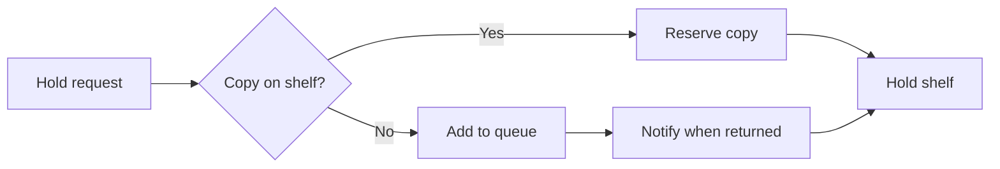

`TD` swaps to top-down. Group related nodes with `subgraph <name> ... end`; remember that lowercase `end` as a node label breaks the parser.

### Sequence diagram

Who sends what to whom, in order. Declare participants so the column order is deliberate rather than accidental.

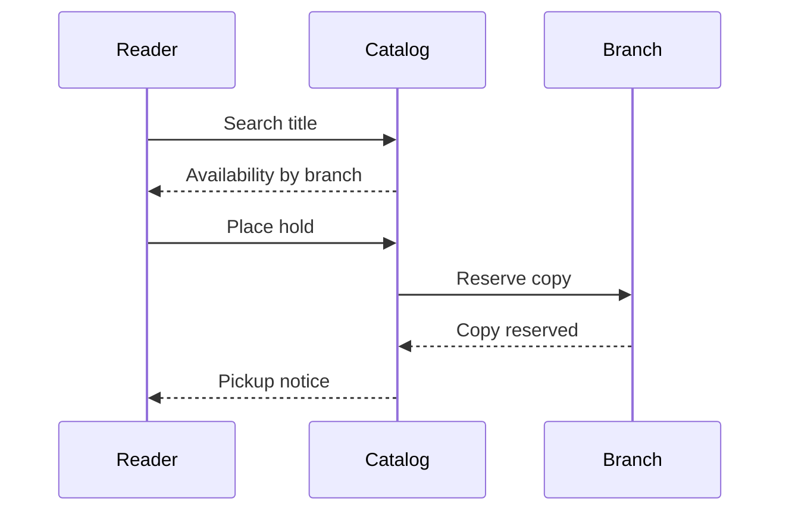

`->>` draws a solid arrow (a call), `-->>` a dotted one (conventionally a reply). Use `Note over A,B: text` for context that is not a message.

### Class diagram

Types, their members, and cardinality. A domain model, not a runtime path.

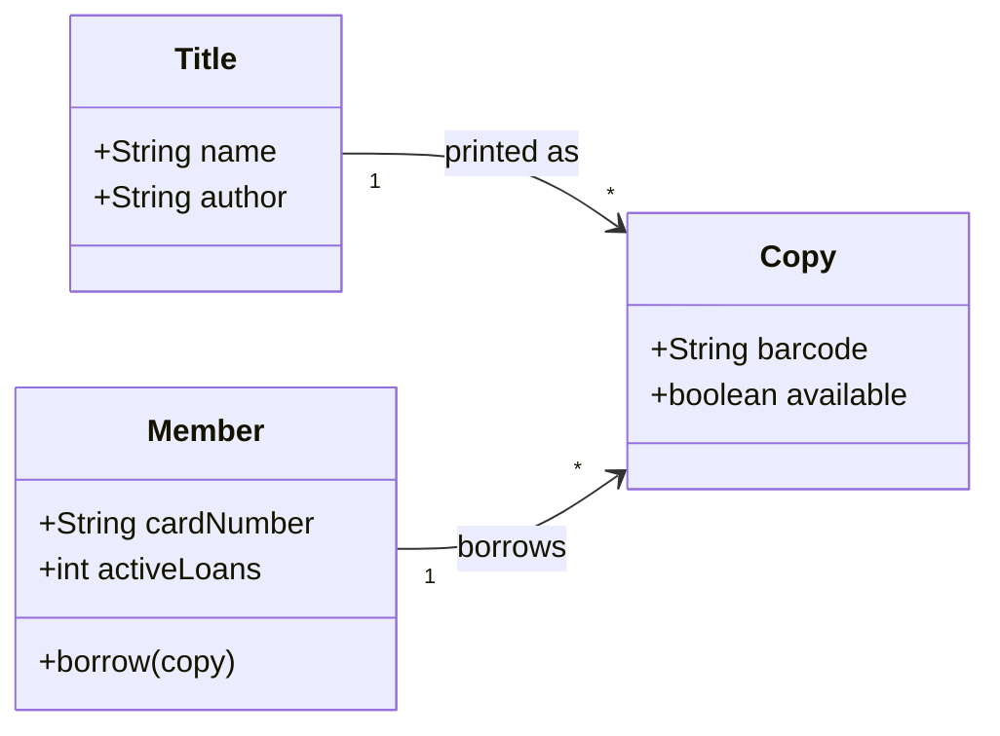

### State diagram

The lifecycle of one thing. The `-v2` suffix is part of the keyword.

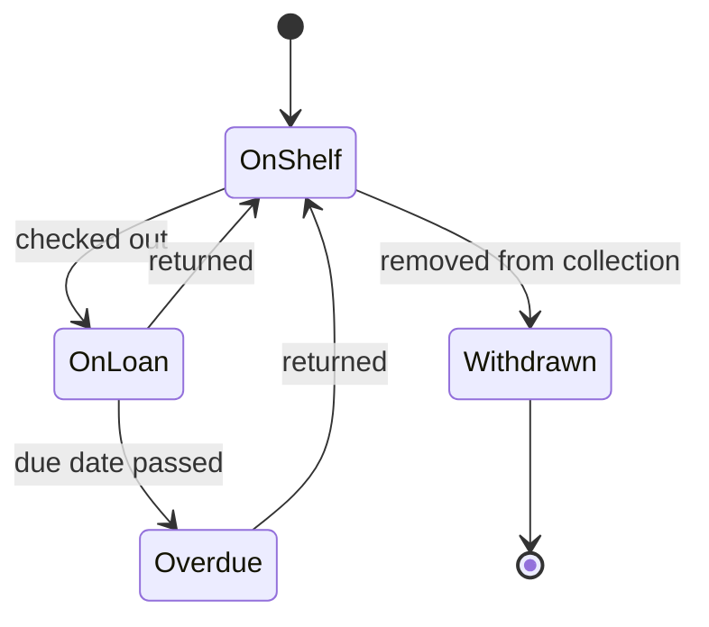

### Entity relationship diagram

Stored entities, their attributes, and how they relate.

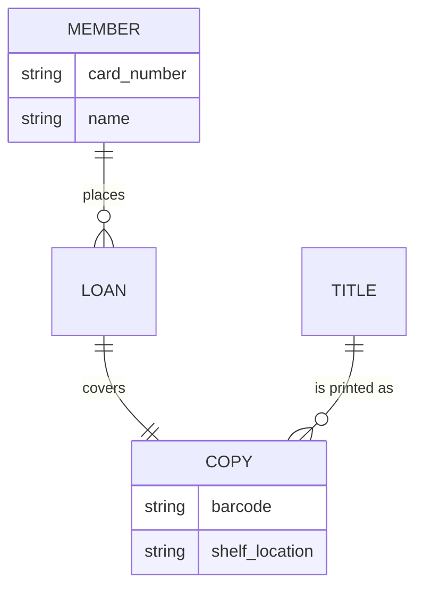

Cardinality is encoded in the connector: `||` exactly one, `o{` zero or more, `|{` one or more.

### Gantt

Dated work with real durations. `dateFormat` describes the dates you write, `axisFormat` the axis labels.

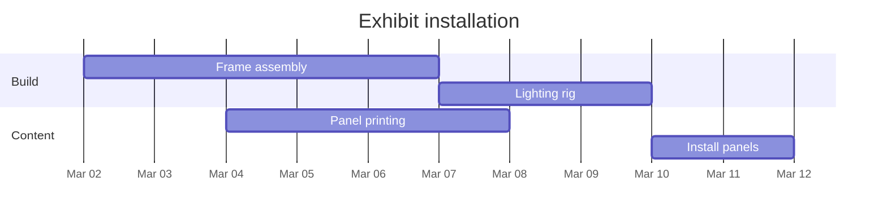

### User journey

A step-by-step experience with a score and the actors involved. The score is 1–5 and precedes the actor list.

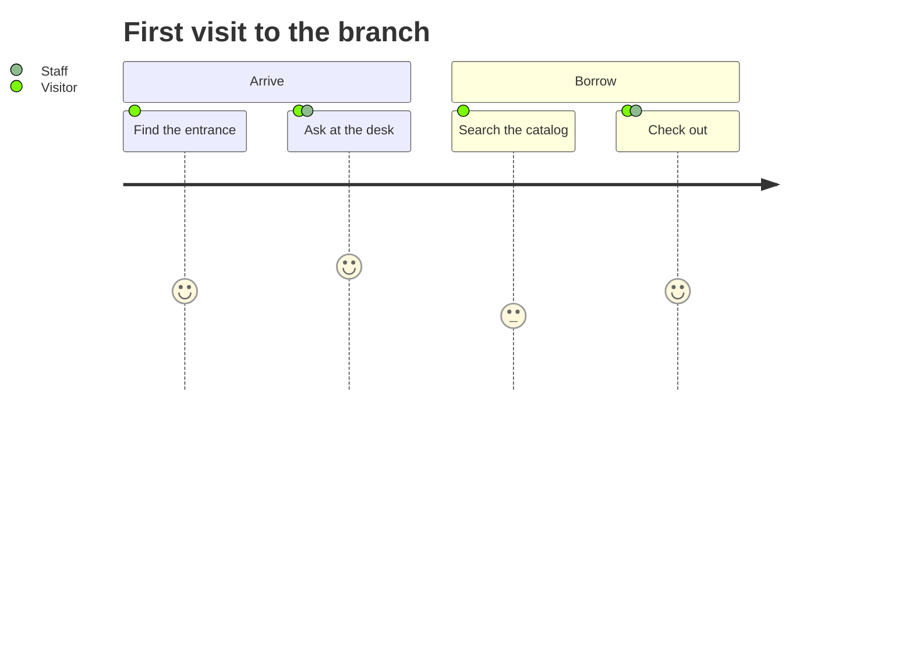

### Pie

Parts of one whole, single level. Quote every label.

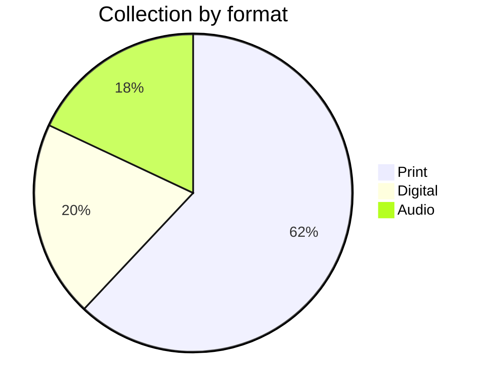

### Mindmap

A branching outline of one topic. Indentation is the entire grammar — keep it consistent and never mix tabs with spaces.

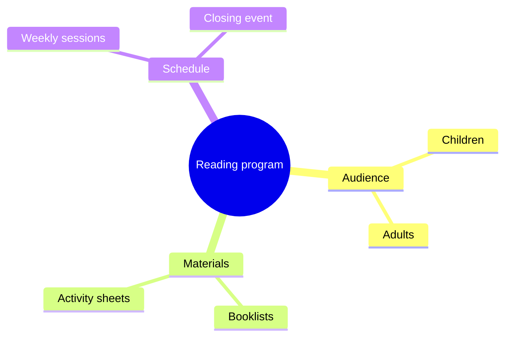

### Timeline

Dated milestones in order. A period may carry several events on the same line, separated by colons.

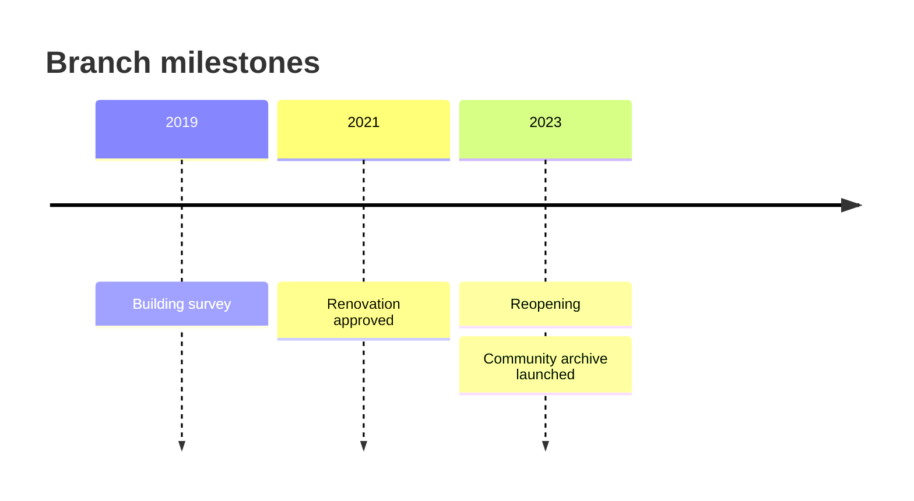

## Version-gated

Each family below needs the compatibility gate first, and each entry names the fallback to use when the target bundle rejects it.

### Sankey

Quantified flow between stages, written as three-column CSV: source, target, value.

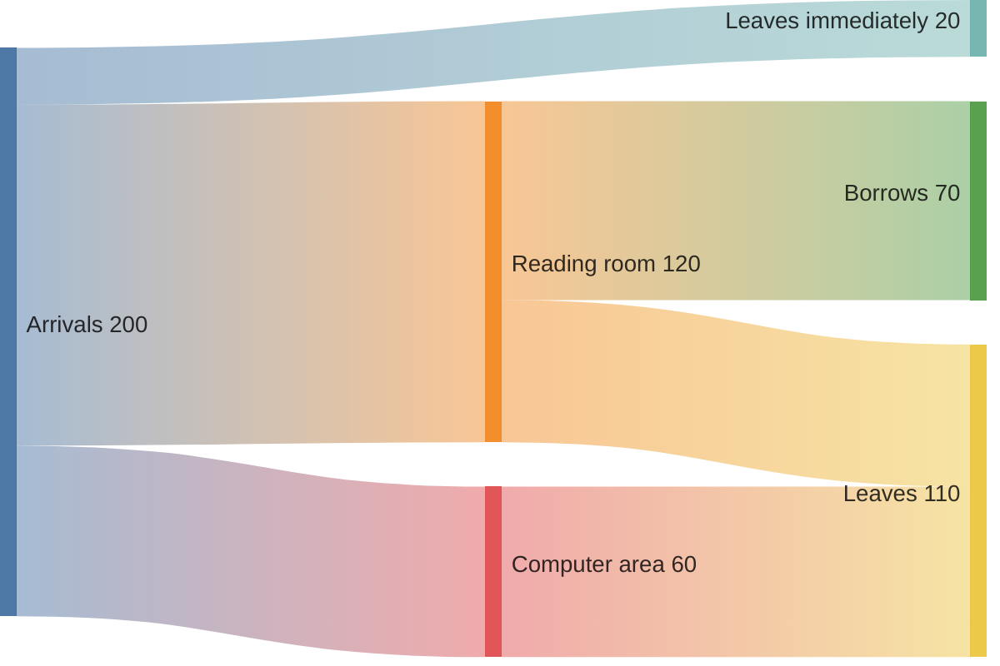

Current Mermaid accepts `sankey` and `sankey-beta`; older bundles accept only `sankey-beta`, so the suffixed form is the compatible one. Wrap any value containing a comma in double quotes.

**Fallback:** a `flowchart LR` whose edge labels carry the quantities.

### Kanban

Work items grouped by workflow column. Columns are top level, tasks are indented beneath them.

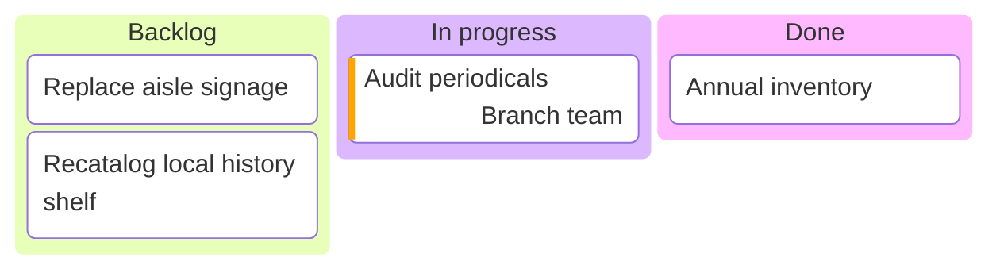

Metadata keys are `assigned`, `ticket`, and `priority`; `priority` accepts only `Very High`, `High`, `Low`, and `Very Low`.

**Fallback:** a Markdown table with one column per stage, or headings with task lists. Both keep every item and its stage.

### Treemap

Nested proportions. Quoted names, indentation for hierarchy, `: value` on leaves.

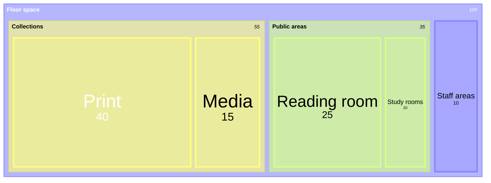

Upstream marks this as a new diagram type whose syntax may still change, so pin the exact spelling you verified.

**Fallback:** `pie` for a single level, plus a table or nested list for the levels `pie` cannot show. Do not ship the `pie` alone if the hierarchy was the point.

### Architecture

Services, the groups that contain them, and directed links between them.

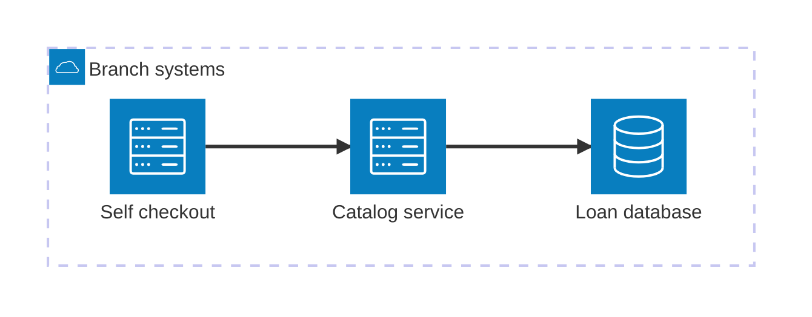

Service and group ids are bare keys — do not quote them. Labels go in `[]`, icons in `()`. Built-in icons are `cloud`, `database`, `disk`, `internet`, and `server`; anything else needs a registered icon pack the bundled renderer may not have.

**Fallback:** the flowchart under [Fallbacks](#fallbacks-that-keep-the-meaning), which keeps the topology and loses only the icons.

### XY chart

Numeric series over categories, as bars, lines, or both.

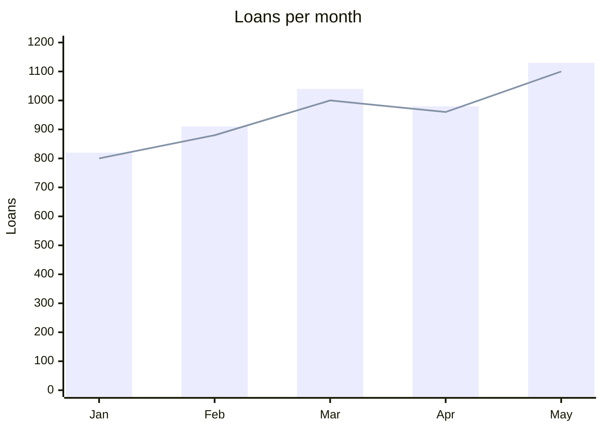

Current Mermaid accepts `xychart` and `xychart-beta`; older bundles accept only `xychart-beta`. Keep every series the same length as the x-axis category list.

**Fallback:** a Markdown table of the same numbers. It keeps every value and loses only the shape — say so when you ship it.

## Fallbacks that keep the meaning

A fallback replaces the drawing, never the information. Worked example — the architecture diagram above, expressed with the conservative core:

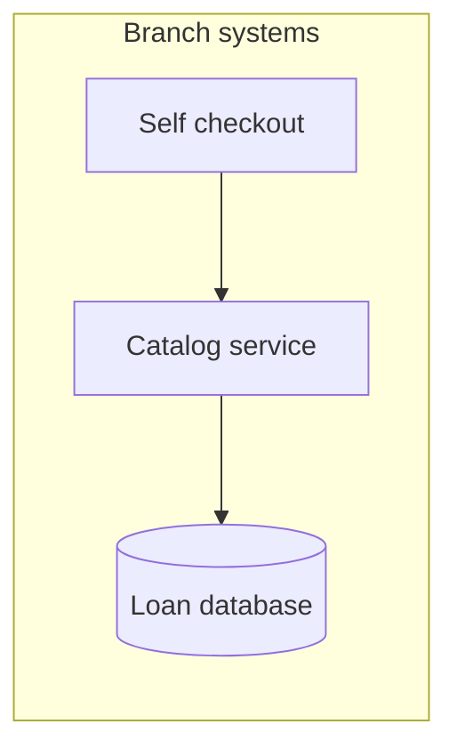

Every service, the group boundary, and both links survive; only the icon set is gone, which is the kind of loss worth one sentence of disclosure.

| Gated family | Fallback | What the fallback drops |
| --- | --- | --- |
| `sankey` | `flowchart LR` with quantities in edge labels | Width-proportional flow |
| `kanban` | Table with one column per stage | Card metadata styling |
| `treemap-beta` | `pie` plus a nested list | Area proportionality across levels |
| `architecture-beta` | `flowchart LR` with a subgraph per group | Icons and port-level edge anchoring |
| `xychart-beta` | Table of values | The visual shape of the series |

When the dropped column above matters to the reader, keep it in prose or a table beside the fallback rather than deleting it.
